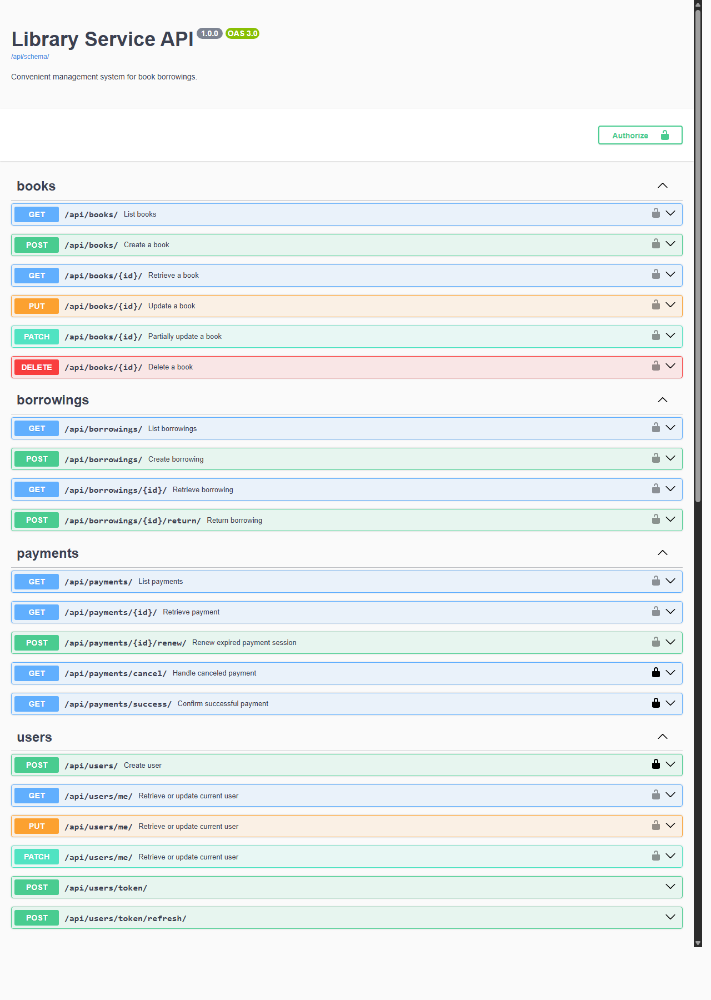

# Library Service API

Library Service API is a RESTful API for managing library operations: book inventory, automated borrowing flows, and payment processing. Built with Django REST Framework, the project focuses on data integrity and scalability, with asynchronous background tasks powering real-time status updates and admin notifications.


<details>
<summary><b>Swagger UI Preview</b></summary>



</details>

---

## Highlights

### 💳 Payments & Fines
- Stripe Checkout sessions are **created automatically** when a book is borrowed or returned late
- Late returns trigger an **overdue fine** (`daily_fee × overdue_days × 2x multiplier`) with its own Stripe session generated on the spot
- Users with **unpaid payments are blocked** from new borrowings until they settle up
- Expired Stripe sessions are detected automatically and can be **renewed in a single API call**

### 🔒 Data Integrity & Concurrency
- Book inventory updates are wrapped in **atomic transactions** with `select_for_update` row-level locking, preventing race conditions under concurrent access
- Borrowing model enforces **database-level constraints** on return dates relative to borrow dates
- Books have a **unique constraint** on `(author, title, cover)` to prevent duplicate entries

### 📬 Notifications & Background Tasks
- Admins receive **Telegram notifications** for new borrowings, overdue books (daily 10 AM report), and successful payments
- Notifications are dispatched via `transaction.on_commit` so they **only fire after the DB transaction succeeds**
- **Celery Beat** runs two periodic tasks: daily overdue borrowing scan and per-minute Stripe session expiration checks

### 🔐 Auth & Permissions
- **Custom user model** with email-based authentication (no username field), JWT tokens with rotation and blacklisting
- Custom `Authorize` header instead of `Authorization` for easy use with the **ModHeader** browser extension
- Custom `IsAdminOrReadOnly` permission class: anyone can browse books, only admins can manage them, users can only access their own borrowings and payments

### 🐳 DevOps & CI/CD
- **Fully dockerized** with Docker Compose running 5 services (Django, PostgreSQL, Redis, Celery worker, Celery Beat), health checks, automatic migrations, and a non-root container user
- **GitHub Actions CI pipeline** runs flake8 linting, black formatting checks, and the full test suite against a PostgreSQL service on every push and PR to `main`
- **Auto-generated API docs** via drf-spectacular with Swagger UI and ReDoc

### 🧪 Testing
- All external services (Stripe API, Telegram Bot API) are **fully mocked**, so the test suite runs without any API keys or network access
- Dedicated **factory helper functions** (`sample_book`, `sample_borrowing`, `sample_payment`, etc.) for clean, readable test setup
- Tests cover **business logic edge cases**: fine calculations, inventory changes on borrow/return, pending payment blocking, double-return prevention
- Celery tasks tested independently: overdue borrowing detection, expired payment scanning

---

## Borrowing & Payment Flow

What happens under the hood when a user borrows a book:

1. System checks the user has **no pending payments** and the **book is in stock**
2. An **atomic transaction** creates the borrowing and decrements inventory with row-level locking
3. Price is calculated (`daily_fee × number_of_days`) and a **Stripe Checkout Session** is created
4. The session is stored as a PENDING payment and a **Telegram notification** goes out to admins

**If a book is returned late:**
fine = `daily_fee × overdue_days × FINE_MULTIPLIER` (2x), a new Stripe session is created for the fine, and the user is blocked from borrowing until it's paid.

**Expired payment sessions** are detected by Celery every minute and can be renewed via `POST /api/payments/<id>/renew/`.

---

## API Endpoints

### 📚 Books

| Method | Endpoint | Description | Access |
|:---|:---|:---|:---|
| `GET` | `/api/books/` | List all books | Anyone |
| `POST` | `/api/books/` | Add a new book | Admin |
| `GET` | `/api/books/<id>/` | Book details with inventory and daily fee | Anyone |
| `PUT/PATCH` | `/api/books/<id>/` | Update a book | Admin |
| `DELETE` | `/api/books/<id>/` | Delete a book | Admin |

### 👤 Users & Auth

| Method | Endpoint | Description | Access |
|:---|:---|:---|:---|
| `POST` | `/api/users/` | Register a new account | Anyone |
| `POST` | `/api/users/token/` | Obtain JWT token pair | Anyone |
| `POST` | `/api/users/token/refresh/` | Refresh access token | Anyone |
| `GET/PUT/PATCH` | `/api/users/me/` | View or update your profile | Authenticated |

### 📖 Borrowings

| Method | Endpoint | Description | Access |
|:---|:---|:---|:---|
| `GET` | `/api/borrowings/` | List borrowings (filter: `?is_active=true`, `?user_id=1`) | Authenticated |
| `POST` | `/api/borrowings/` | Borrow a book | Authenticated |
| `GET` | `/api/borrowings/<id>/` | Borrowing details with associated payments | Authenticated |
| `POST` | `/api/borrowings/<id>/return/` | Return a borrowed book | Authenticated |

> Non-admin users see only their own borrowings. Admins can filter by `user_id` to view any user's history.

### 💳 Payments

| Method | Endpoint | Description | Access |
|:---|:---|:---|:---|
| `GET` | `/api/payments/` | List your payments | Authenticated |
| `GET` | `/api/payments/<id>/` | Payment detail with Stripe session info | Authenticated |
| `POST` | `/api/payments/<id>/renew/` | Renew an expired payment session | Authenticated |
| `GET` | `/api/payments/success/?session_id=...` | Stripe success callback | Public |
| `GET` | `/api/payments/cancel/` | Stripe cancel callback | Public |

> Interactive docs at `/api/docs/swagger/` (Swagger UI) and `/api/docs/redoc/` (ReDoc).

---

## Getting Started

**Prerequisites:** Docker & Docker Compose, a [Stripe test account](https://docs.stripe.com/test-mode), a [Telegram bot](https://t.me/BotFather)

**1. Clone and configure:**

```bash
git clone https://github.com/omerlenko/library-service-api
cd library-service-api
cp .env.sample .env
```

**2. Fill in your `.env`:**

```env
DJANGO_SECRET_KEY=your-secret-key
TELEGRAM_CHAT_ID=your-chat-id
TELEGRAM_BOT_TOKEN=your-bot-token
STRIPE_SECRET_KEY=sk_test_your-stripe-key
POSTGRES_DB=library_service
POSTGRES_USER=postgres
POSTGRES_PASSWORD=your-password
POSTGRES_HOST=db
POSTGRES_PORT=5432
CELERY_BROKER_URL=redis://redis:6379
CELERY_RESULT_BACKEND=redis://redis:6379
```

**3. Run it:**

```bash
docker-compose up --build
docker-compose exec web python manage.py createsuperuser
```

This brings up 5 services: **Django API** (port 8000), **PostgreSQL**, **Redis**, **Celery worker**, and **Celery Beat**. Migrations run automatically on startup.

Open `http://localhost:8000/api/docs/swagger/` and you're good to go.

---

## Tests

```bash
docker-compose exec web python manage.py test
```

Covers borrowing/return flows, Stripe integration (mocked), Telegram dispatch (mocked), Celery scheduled tasks, permissions and access control, fine calculations, and JWT auth. External services are fully mocked so tests run without any API keys.

Code quality is enforced on every push to `main` via **GitHub Actions** running flake8, black, and the full test suite.
